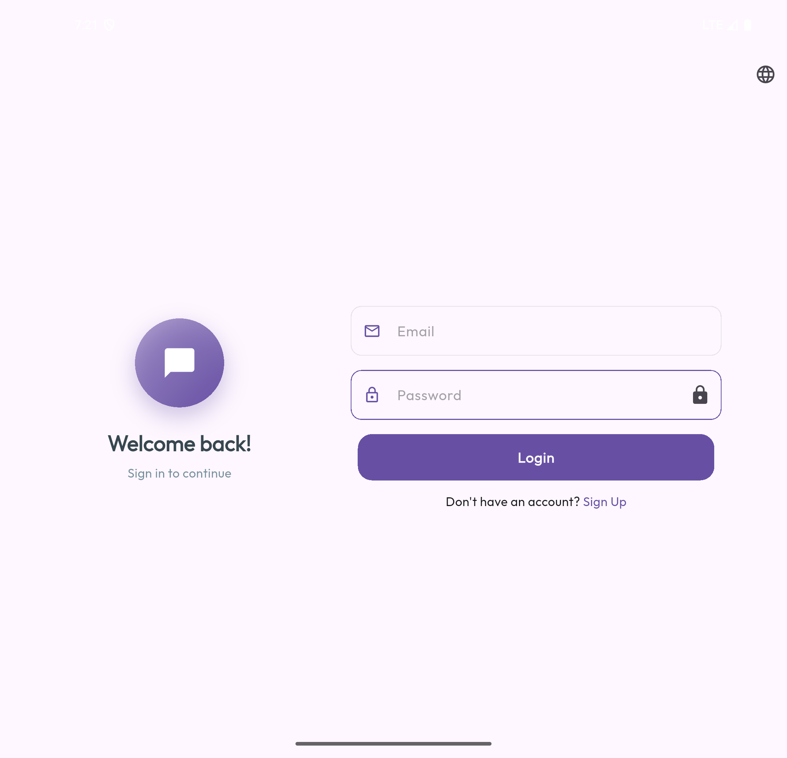
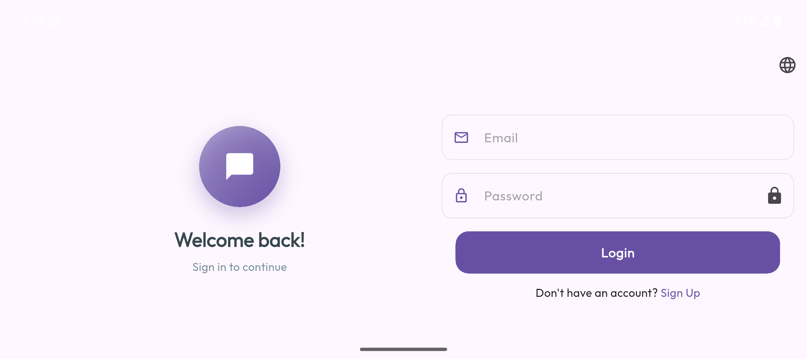
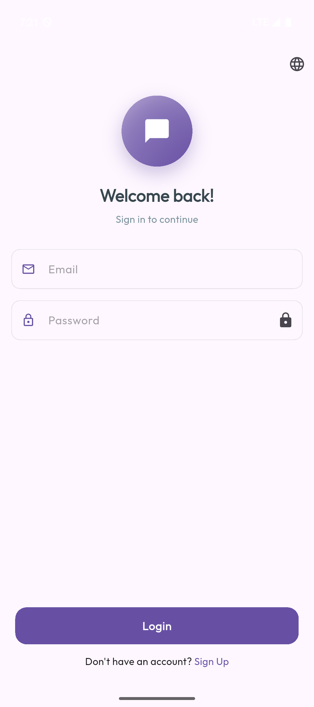

# Chat App Ex 💬

A modern, responsive Flutter chat application with real-time messaging capabilities and beautiful UI across all device types.

## 📱 Download

**[📲 Download APK](apks/app-release.apk)**

## ✨ Features

- **Real-time Chat**: Instant messaging with seamless delivery
- **Responsive Design**: Optimized for mobile, tablet, foldable, and desktop
- **Modern UI**: Beautiful Material Design 3 interface
- **User Authentication**: Secure login and signup system
- **Cross-Platform**: Works on Android, iOS, and Web
- **Adaptive Layouts**:
  - Mobile: Bottom navigation
  - Tablet: Navigation rail and landscape optimization
  - Desktop: Three-panel layout with extended features

## 🖼️ Screenshots

### Mobile App Screens

<table>
  <tr>
    <td align="center">
      
      <br> 
    </td>
    <td align="center">
      
      <br> 
    </td>
    <td align="center">
      
      <br> 
    </td>
    <td align="center">
      
      <br> 
    </td>
  </tr>
  <tr>
    <td align="center">
      
      <br> 
    </td>
    <td align="center">
      
      <br> >
    </td>
    <td align="center">
      
      <br> 
    </td>
    <td align="center">
      
      <br> 
    </td>
  </tr>
  <tr>
    <td align="center">
      
      <br> 
    </td>
    <td align="center">
      
      <br> 
    </td>
    <td align="center">
      
      <br> 
    </td>
<td align="center">
      
      <br> 
    </td>
    
  </tr>
</table>

## 🛠️ Technologies Used

- **Flutter**: Cross-platform mobile development framework
- **Dart**: Programming language
- **Bloc/Cubit**: State management
- **Responsive Builder**: Adaptive layouts for different screen sizes
- **Material Design 3**: Modern UI components
- **Freezed**: Code generation for immutable classes

## 🏗️ Architecture

The app follows Clean Architecture principles with:

- **Feature-based Structure**: Organized by features (login, home, chat)
- **State Management**: BLoC pattern with Cubit
- **Responsive Design**: Device-specific layouts
- **Modular Components**: Reusable widgets and utilities

## 🚀 Getting Started

### Prerequisites

- Flutter SDK (>=3.0.0)
- Dart SDK (>=3.0.0)
- Android Studio / VS Code
- Android SDK / Xcode (for iOS)

### Installation

1. **Clone the repository**

   ```bash
   git clone https://github.com/yourusername/chat_app_ex.git
   cd chat_app_ex
   ```

2. **Install dependencies**

   ```bash
   flutter pub get
   ```

3. **Generate code**

   ```bash
   dart run build_runner build
   ```

4. **Run the app**
   ```bash
   flutter run
   ```

```
lib/
├── core/               # Core utilities and constants
├── features/           # Feature modules
│   ├── login/         # Authentication features
│   ├── home/          # Home and navigation
│   └── chat/          # Chat functionality
├── shared/            # Shared widgets and utilities
└── main.dart          # Application entry point
```
